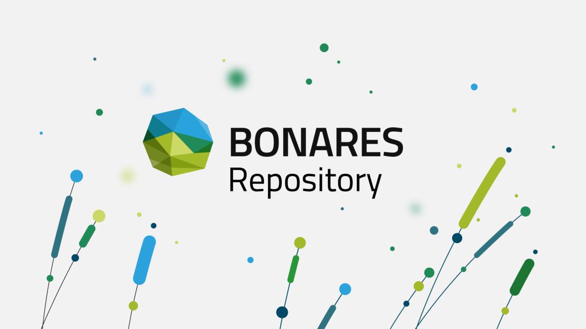

### Practical handbook for publishing research data in the BonaRes Repository – Tips & Tricks

In the BonaRes Repository, digital research data of soil and agricultural sciences are published and
made accessible and reusable for other scientists and interested parties. Scientific data collection is
usually associated with high organizational effort and costs. Some data cannot be reproduced at all. It is
therefore important to avoid data loss and to make research data permanently usable. The publication
of the research data are also part of good scientific practice in order to make research results
reproducible. Already in 2003, with the increasing use of digital media, the Berlin Declaration on Open
Access to Scientific Knowledge stipulated that a “(…) complete version of the work and all supplemental
materials (...) in an appropriate standard electronic format is deposited (and thus published) in at least
one online repository”
1
. Many public funding agencies even fund or even demand that research data are
published. So for example the following research sponsors:

German Research Foundation (Deutsche Forschungsgemeinschaft, DFG): “If scientific knowledge is
made publicly available, the underlying research data (...) are accessible and understandable in the
facility (...) or in cross-location repositories.”2
Leibniz Association (Leibniz-Gemeinschaft, WGL): “(...) supports sustainable research data management
as a framework for securing and documenting research data, in particular by (...) promoting the greatest
possible accessibility and reuse of research data according to the principle "as open as possible, as closed
as necessary“
3
European Commission (Europäische Kommission, EC): “(...) the beneficiaries must (...) deposit in a
research data repository and take measures to make it possible for third parties to access, mine, exploit,
reproduce and disseminate - free of charge for any user - the following: (i) the data, including associated
metadata, needed to validate the results presented in scientific publications (...)”
4
Federal Ministry of Education and Research (Bundesministerium für Bildung und Forschung, BMBF):
“The applicants undertake to make data obtained within the project (...) available for secondary use
according to the rules of good scientific practice. In order to ensure archiving of the data and also to
enable subsequent use by third parties, (...) the data must be prepared and documented and handed
over to a suitable research data center”
5

# Page title here

:::font-bold
content of the div
:::

:::font-bold { #doc-site-header }
content of the div
:::

:::text-lg
content of the div
:::

This is a paragraph.

Both [internal](README.md) and [external](https://example.com) links work.

Another paragraph with **bold**, _italic_, ~~strikethrough~~, and `code` samples.

---

## Lists

- First item
- Second item
- Third item

1. First item
2. Second item
3. Third item

> "Cool! This is a quotation."

!!!
Need to draw attention to something? Use an alert.
!!!

:::sample
This text is wrapped in a Container component and has a custom css `class` applied.
:::

:::sample { #container1 }
This Container has a custom `id` attribute.
:::